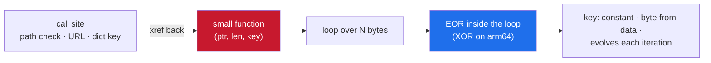
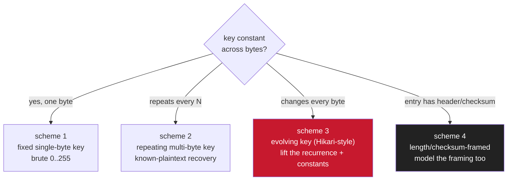
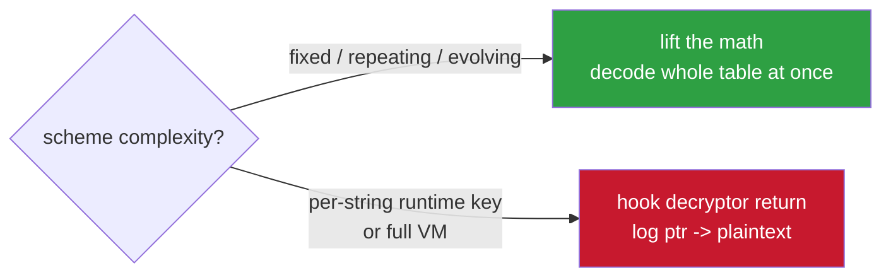

<h1 align="center">xor-string-deobf-notes</h1>

<p align="center">breaking XOR string obfuscation in a binary — pull every hidden string out statically, without running anything</p>

<p align="center">
  
  
  
</p>

---

This is the most common scheme you hit: the app's own strings (URLs, class names it
checks for, jailbreak paths, error text) are stored XOR'd and decrypted at runtime.
Once you understand the decrypt routine you can pull every hidden string out
statically, without running anything.

---

## contents

- [how you know it's there](#how-you-know-its-there)
- [find the decryptor first](#find-the-decryptor-first)
- [the four schemes you'll actually see](#the-four-schemes-youll-actually-see)
- [lifting the constants (don't guess)](#lifting-the-constants-dont-guess)
- [script the whole table](#script-the-whole-table)
- [sanity checks so you don't chase ghosts](#sanity-checks-so-you-dont-chase-ghosts)
- [when it's not worth breaking statically](#when-its-not-worth-breaking-statically)

---

## how you know it's there

Open the strings view. System stuff is plain ASCII (`NSString`, `/System/...`, Apple
framework names). The app's own secrets are gone, and instead you see runs of
high-entropy bytes in `__data` / `__const` / a custom section. **That gap is the
tell:** obvious strings for the OS, garbage where the app's real logic lives.

Sometimes the strings are still visible but split into single chars, or reversed, or
there's an obvious loop near a string reference doing arithmetic. All of that is
"decrypt at runtime", which is what we're breaking.

---

## find the decryptor first

Every obfuscated string gets decoded by some routine before use. Find it by xref-ing
from a call site. Pick a place where the app clearly needs a plaintext string (a path
check, a URL, a dictionary key) and look at what runs right before the string is used.
You'll see a call into a small function that takes a pointer (and often a length and a
key) and returns/fills a buffer.



Signs you found the decryptor:

- a loop over N bytes
- an `EOR` (that's XOR on ARM64) inside the loop
- the key is either a constant, a byte pulled from the data itself, or evolves each
  iteration

Decompile it and rewrite the loop in your head as plain math. That's the whole job —
everything else is applying it in bulk.

---

## the four schemes you'll actually see



### 1. Fixed single-byte key — the laziest one

```c
for (i = 0; i < len; i++) out[i] = data[i] ^ 0x54;
```

Break it by trying every key `0..255` on a blob and picking the one that produces
printable ASCII. Or if you saw the constant in the disasm, just use it.

### 2. Repeating multi-byte key (XOR "vigenère")

```c
for (i = 0; i < len; i++) out[i] = data[i] ^ key[i % keylen];
```

If you know any plaintext (say a string always starts with `http` or `/Applications`),
XOR the ciphertext against the known plaintext to recover key bytes, then confirm the
key length repeats. Classic known-plaintext recovery.

### 3. Position-dependent / evolving key

This is what modern obfuscators (Hikari-style, and most commercial ones) do. The key
changes every byte based on the index and some constants:

```c
K = seed;
for (i = 0; i < len; i++) {
    out[i] = data[i] ^ K;
    K = ((K + i) ^ XC) + AC;     // XC, AC are per-build constants baked in
}
```

You can't guess this one byte-by-byte — you have to lift the exact recurrence from the
disasm, including the constants `XC`/`AC` and the seed. Once you have those, it's
deterministic: port the loop to Python and run it over the table.

### 4. Length/checksum-framed entries

Often the "string" isn't just chars — it's a small record: first byte is a per-entry
key or the length, last byte is a checksum so the app can verify the decode. Something
like:

```
[key][len^key][ enc bytes... ][ checksum ]
```

You have to model that framing too, or your decode is shifted by a byte and looks
almost-right.

> [!TIP]
> If your output is one char off at the start, suspect a **header byte** you didn't
> account for.

---

## lifting the constants (don't guess)

For scheme 3 you need the exact `seed`, `XC`, `AC`. Read them straight out of the
decompiled decryptor — they're immediates in the loop:

```asm
; K = ((K + i) ^ 0x1F) + 0x0C   ->   XC = 0x1F, AC = 0x0C
```

If the decryptor is itself obfuscated (control-flow flattened, so the constants are
scattered), **brute a small range** instead: you know a handful of plaintext strings
the app must contain (its own class names from `__objc_methname`, or common paths).
Decode one known entry against every `(XC, AC)` in a bounded range and keep the pair
that yields your known string. Then that pair decodes the whole table.

---

## script the whole table

Once the scheme is nailed, dump every entry. Rough shape in IDAPython:

```python
import ida_bytes, ida_segment

TABLE = 0x0                       # start of the obfuscated string section
seg   = ida_segment.getseg(TABLE)
data  = ida_bytes.get_bytes(TABLE, seg.end_ea - TABLE)

def decode(off, seed, XC, AC, hdr=2):
    # example for scheme 3 with a [key][len] header, adjust to what you found
    key = data[off]
    ln  = data[off + 1] ^ key
    if ln < 3 or ln > 200 or off + hdr + ln >= len(data):
        return None
    out, K = bytearray(), key
    for j in range(ln):
        out.append((data[off + hdr + j] ^ K) & 0xFF)
        K = (((K + j) ^ XC) + AC) & 0xFF
    if all(32 <= c < 127 for c in out):
        return out.decode()
    return None

# walk the section, print anything that decodes to clean ASCII
for off in range(len(data) - 3):
    s = decode(off, seed=..., XC=..., AC=...)
    if s and len(s) >= 4:
        print(hex(TABLE + off), s)
```

Then grep the output for what you care about — `report`, `jailbreak`, `http`,
`dylib`, whatever the app was hiding. Now you've got the app's whole vocabulary of
checks and endpoints in one pass.

---

## sanity checks so you don't chase ghosts

Decode a string you can guess first (an endpoint host, a known class name). If that
comes out clean, your constants are right and the rest is trustworthy.

| symptom | cause |
|---------|-------|
| decodes clean | constants right, rest is trustworthy |
| one char off at the start | header/framing byte you missed |
| every other char wrong | key evolving in the wrong direction, or off-by-one on the index in the recurrence |
| total garbage | wrong section, wrong constants, or entries aren't ASCII (could be UTF-16, or packed bytes not a string) |

---

## when it's not worth breaking statically

> [!NOTE]
> If the obfuscator is nasty (per-string keys derived from runtime state, or a VM that
> interprets the decode), skip the static route.

Just hook the decryptor's return, let the app decrypt strings for you, and log
`(ciphertext_ptr -> plaintext)` pairs as they happen. You lose the "get everything at
once" benefit but you never have to model the scheme.



For anything short of a full VM, though, lifting the math is faster and gives you the
complete table.

---

<p align="center">— shiedless</p>
